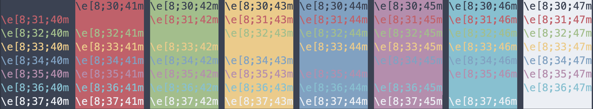
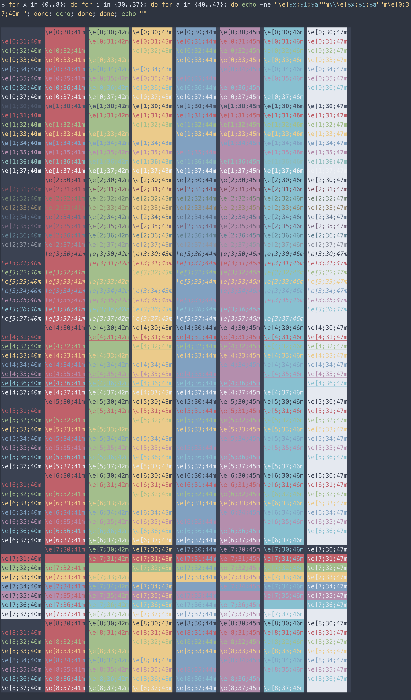

# asciinema-theme-nord

[Nord theme](https://www.nordtheme.com) for [asciinema](https://asciinema.org).



See: https://github.com/asciinema/asciinema-player/wiki/Custom-terminal-themes

## TLDR

```html
<html>
<head>
  ...
  <link rel="stylesheet" type="text/css" href="/asciinema-player.css" />
  <link rel="stylesheet" type="text/css" href="/asciinema-theme-nord.css" /> <!-- ADDED -->
  ...
</head>
<body>
  ...
  <asciinema-player src="/demo.json" theme="nord"></asciinema-player> <!-- NOTE theme="nord" -->
  ...
  <script src="/asciinema-player.js"></script>
</body>
</html>
```

## Example

Run the following to see the theme in action:

```shell
npm install
npx serve &
open http://locahhost:3000/example
```

## Reference

To test the theme, a reference image was captured.



This [snippet](https://askubuntu.com/a/279014) was used to generate the output:

```shell
for x in {0..8}; do for i in {30..37}; do for a in {40..47}; do echo -ne "\e[$x;$i;$a""m\\\e[$x;$i;$a""m\e[0;37;40m "; done; echo; done; done; echo ""                                                                        
```

